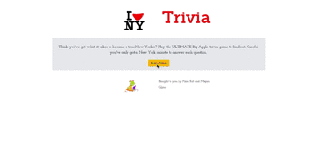

# Timed Trivia Game 	:alarm_clock:
https://megangilpin.github.io/Trivia-Game/

### Overview

Created a timed trivia game using jQuery, setTimeout() and setInterval() methods.

### Functionality Breakdown
Question and answer slides are dynamically displayed on the screen. A 30 second timer for each question is displayed on the screen with the help of setTimeout() and setInterval(). 

Once the player guesses the question, an answer slide is displayed then changes to the next question without user interaction. At the end of the game the user is shown how many questions were answered correctly. 

### Technology Used
- JQuery
- JavaScript
- Bootstrap
- HTML

### Technical Approach
1. Establish the following global variables:
    1. Variable to represent the number of the current question
    1. Two variabls to help tally the score, one for the number correct and one for the number wrong
    1. Variable equaling 25, to be used as the count down timer
    1. Variable called timer to represent the setInterval() funciton
1. Create a 5 question objects, one for each question that will have the following keys:
    1. The question to be asked to the user
    1. List of possible answers
    1. Correct answer
1. Make an array containing all the question objects
1. Create the following functions that conducitons the logic of the game
    1. Starts a new round by chaning the global question variable and checks if the game is over
    1. Event handler to check if the user clicked on the correct answer
    1. Starts the timer and marks the question wrong if the time runs out before the user selects an answer
    1. Dynamically displays the correct answer onto the page and informs the user chose the correct answer, adds 1 to the global correct answer variable 
    1. Dynamically displays the correct answer onto the page and informs the user they got the answer wrong, adds 1 to the global wrong asner variable 
1. Build a function to do the following when called:
    1. Dynmaically displays the question and possible answers as a button onto the page
    2. Starts the timer using the global timer variable and setinterval()
    3. Calls the funciton that checks if the answer is correct that will then display the correct answer and inform the user if they got it correct or incorrect 
1. Create a function to dynmically display the final score and resets the game if the user clicks on the play again button
